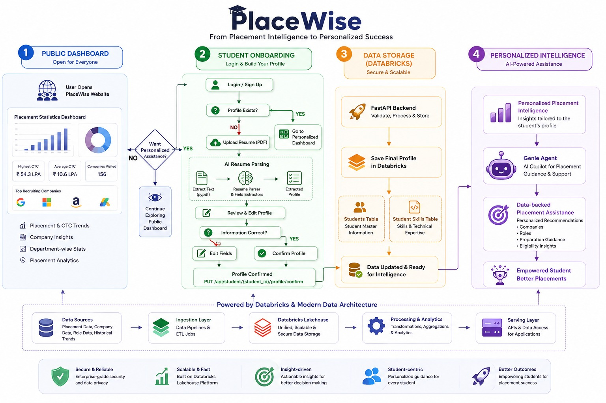

# 🎓 PlaceWise

## From Placement Intelligence to Personalized Success

PlaceWise is an AI-powered campus placement intelligence platform designed to help students make smarter placement decisions using their academic profile, skills, resume information, company requirements, historical placement data, placement-test topics, and interview-question intelligence.

Instead of providing generic placement advice, PlaceWise aims to answer questions such as:

- Which companies are the best fit for me?
- What skills am I missing for a particular company?
- What interview topics should I prepare?
- Which DSA and Core CS topics are commonly asked?
- What should I improve to increase my placement opportunities?
- If I improve a particular skill, which new opportunities could become available?

At the core of PlaceWise is a **Databricks Genie Agent**, which provides natural-language, data-backed placement intelligence over the campus placement data.

---

# 🚀 Problem Statement

Students often prepare for placements using scattered sources of information:

- Generic coding platforms
- Random interview experiences
- Company websites
- Seniors' advice
- Unstructured placement-cell data
- Personal assumptions about company requirements

This creates a gap between:

> **What a student knows**

and

> **What companies actually expect.**

A student may have strong programming skills but still be underprepared for a particular company because of gaps in DSA, Core CS, databases, operating systems, networking, or other technical areas.

At the same time, placement teams have valuable historical data but often lack an intelligent way to convert that data into actionable insights.

### PlaceWise addresses this gap by combining student information with placement intelligence and company requirements.

---

# 🏗️ System Architecture

PlaceWise follows a modern data and AI architecture built around
FastAPI, Databricks Lakehouse, and Databricks Genie.



# 💡 Solution

PlaceWise combines multiple sources of placement intelligence:

```text
Student Profile
      +
Resume & Skills
      +
Company Requirements
      +
Historical Placements
      +
Interview Questions
      +
Placement Test Topics
      ↓
Databricks Lakehouse
      ↓
Genie Agent
      ↓
Personalized Placement Intelligence

